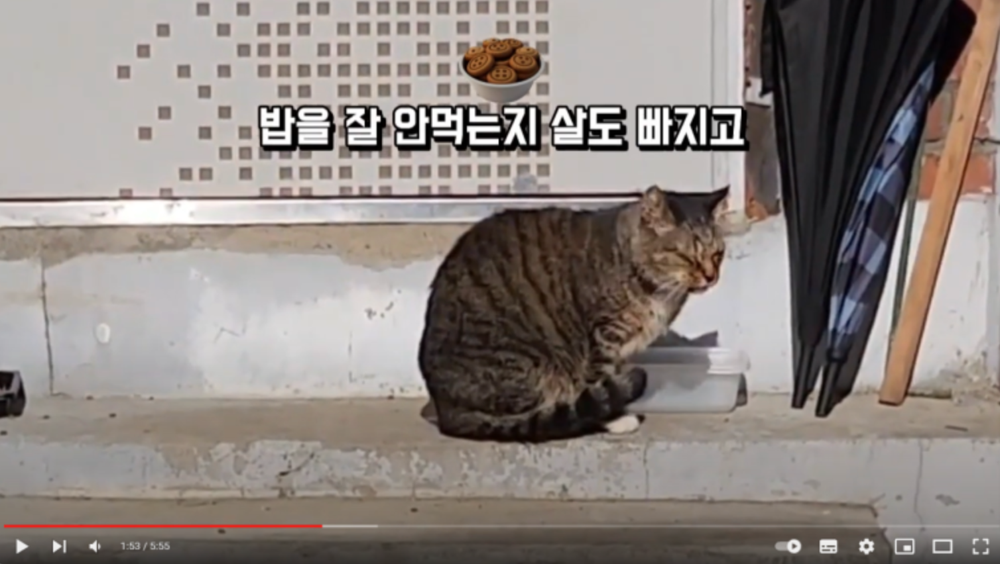
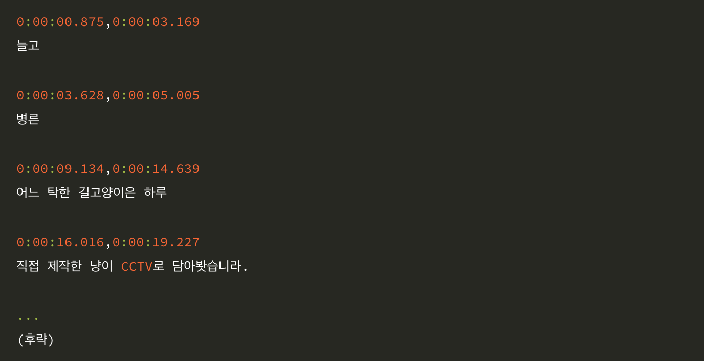

# SBV from Video

- 동영상에 렌더링 된 자막텍스트를 sbv 파일로 추출합니다.
- EasyOCR, OpenCV를 이용해서 화면속에 존재하는 텍스트를 추출합니다.
- 이 때 추출된 텍스트에 변화가 있는 시점을 기준으로 sbv 파일을 만듭니다. 

## 개발하게 된 계기

- 아래 글에 개발하게 된 이유가 설명되어 있습니다.
    - [영상 속에 렌더링 된 자막을 추출하는 방법을 소개합니다!](https://blog.naver.com/dolja21/223370309323)

## 실행하기 전에 필요한 것

- main.py의 아래 부분에 추출할 동영상 파일의 경로를 입력합니다.
    - ```python
        ...
      
        def frame_to_time(fps, frame):
        as_msecond = (frame / fps) * 1000
        td = timedelta(milliseconds=as_msecond)
        if str(td).find('.') == -1:
        return "%s.000" % str(td)
        return str(td)[:-3]
        
        filepath = '** 자막을 추출할 동영상 파일 **' #<- 여기
        video = cv2.VideoCapture(filepath)
      
        ...
        ```
- main.py의 또 다르느 아래 부분에 sbv 파일의 경로를 입력합니다.
  - ```python
      ...
      
      video.release()

      f = open('** 저장할 sbv 파일의 경로 **', 'w') #<- 여기
      for cap in data:
      start_time = frame_to_time(fps, cap[0])
      end_time = frame_to_time(fps, cap[1])
      f.write("%s,%s\n" % (start_time, end_time))
      f.write("%s\n\n" % cap[2])
      f.close()
      
      ...
      ```     
- 주의: GPU 환경에서 실행될 때와 아닐 때의 실행속도 차이가 크게 납니다.  

## 실행방법

- 아래와 같은 동영상에서 자막을 추출한다고 예시를 들어보겠습니다.
    - 
- 파이선 파일을 실행합니다.
    - ``python main.py``
- 그러면 아래와 같은 형태의 sbv 파일이 생성됩니다.
    - 

## 사용된 기술

- easyocr
- opencv

## 앞으로의 계획

- 추출 정확도 개선
- None GPU 환경에서의 실행속도 개선


